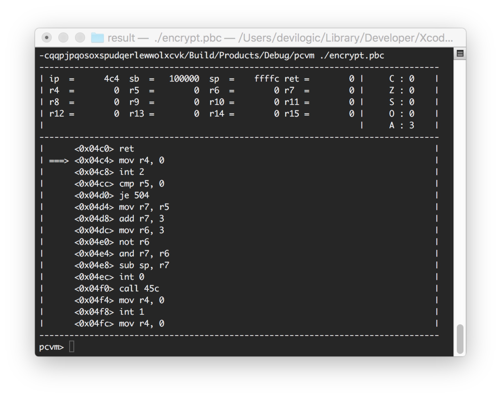

# polycypt

目前只是一个基础的版本，算法的变形力度不够，以下是简单的帮助。

* pcvm 虚拟机
* pcasm 汇编器
* polycypt 算法变形引擎

其中为了进行测试，使用了 "_xxx\_main.cpp_"，进行外部测试。可单独编译成库进行使用。

使用_polycypt_随机生成加解密算法，执行

`polycypt -t template_path result_dir` 命令。

在`result_dir`中生成4个文件`encrypt.asm`，`decrypt.asm`，`encrypt.pbc`，`decrypt.pbc`，其中`.asm`文件是生成的汇编源代码，用于查看。`.pbc`是编译后的字节码文件。用_pcvm_进行执行。

`template_path`是模版路径，用于算法支持。<可选项>

## pcvm编译与使用
1. pcfile.h
2. pcvm.h
3. pcvm.cpp
4. pcvm_main.cpp

### 调试器开启
```
if (vm.run((unsigned char*)codes, codesize, entry, false) == false) {
  printf("error : %d\n", vm.error());
}
```
虚拟机的`run`接口最后一个参数，如果设置为true则启动调试器模式。运行后会出现一个简单的调试器如下：


调试只有三条指令

* c 继续运行
* q 退出
* h 帮助

### 使用命令
```
usage: pcvm [options] <bytecode file>
-d                disasm
-i <port> <file>  bind input io to file
-o <port> <file>  bind output io to file
```

## pcasm编译与使用
1. pcfile.h
2. pcvm.h
3. pcasm.h_
4. pcasm.cpp
5. pcvm_main.cpp

### 使用命令
```
usage: pcasm <asm file> [out file]
```

## polycypt编译与使用
1. pcfile.h
2. pcasm.h
3. pcasm.cpp
4. pcasm.cpp
5. polycypt_alg0.cpp
6. polycypt_alg0.h
7. polycypt_error.h
8. polycypt_factory.cpp
9. polycypt_factory.h
10. polycypt.cpp
11. polycypt.h
12. polycypt_main.cpp

### 使用命令
```
usage: polycypt [options] <output path>
-t <template dir path>
```
